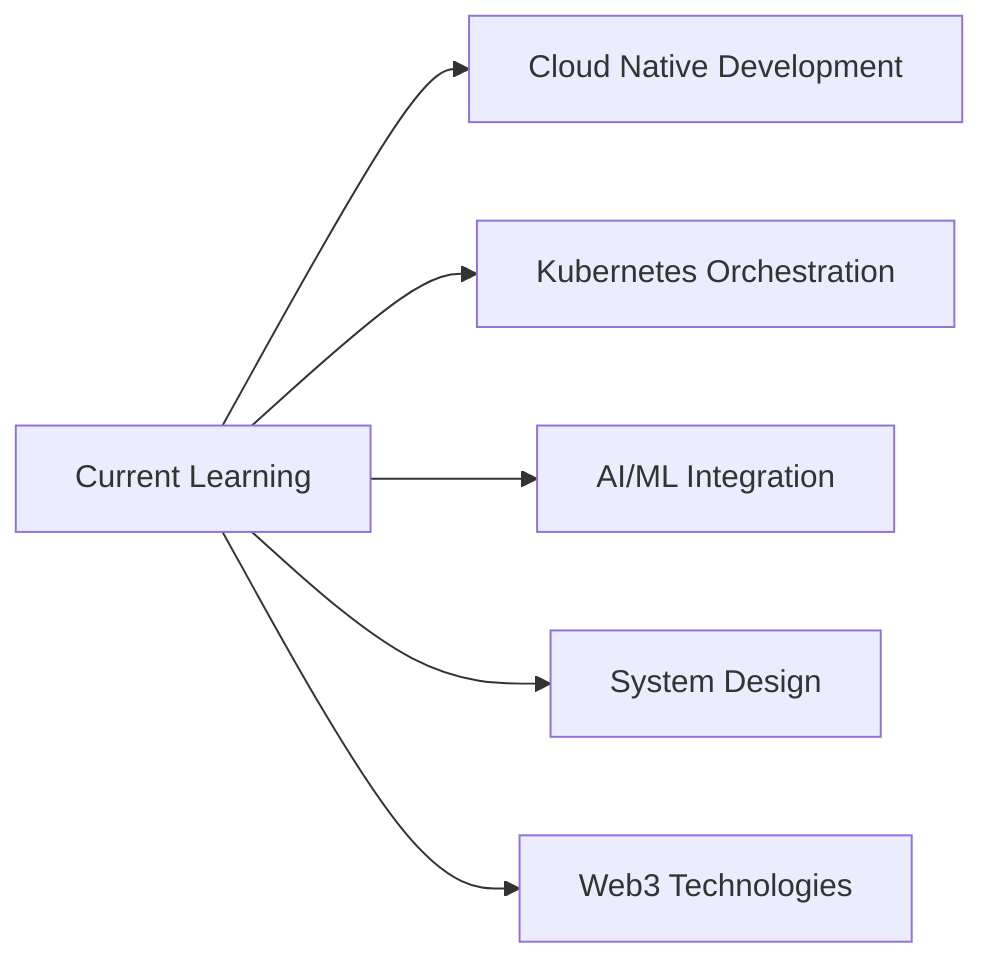

#  Hey there, I'm gatoOverflow

<div align="center">
  
</div>

## 🚀 About Me

```javascript
const gatoOverflow = {
    role: ["Full Stack Developer", "Software Engineer", "DevOps Engineer"],
    location: "Earth 🌍",
    workingOn: "Scalable web applications & cloud infrastructure",
    learning: "Always something new",
    askMeAbout: ["Web Dev", "Cloud", "DevOps", "System Design", "Best Practices"],
    funFact: "I can center a div in 10 different ways",
    motto: "Write code that your future self will thank you for"
};
```

## 💼 Professional Summary

Versatile **Full Stack Engineer** with expertise across the entire software development lifecycle. From crafting pixel-perfect frontends to architecting scalable backend systems and implementing robust DevOps pipelines. I believe in writing clean, maintainable code and building solutions that make a difference.

## 🛠️ Tech Arsenal

### 👨‍💻 Programming Languages


### 🎨 Frontend Development


### ⚙️ Backend Development


### 🗄️ Database Technologies


### ☁️ Cloud & DevOps


### 🧰 Tools & Technologies


## 📊 GitHub Analytics

<div align="center">
  
  
</div>

<div align="center">
  
</div>

## 🏆 GitHub Trophies

<div align="center">
  
</div>

## 💡 Core Competencies

### Architecture & Design
- **Microservices Architecture** - Designing distributed systems with proper service boundaries
- **RESTful APIs & GraphQL** - Building scalable and efficient APIs
- **Event-Driven Architecture** - Implementing message queues and event streaming
- **Domain-Driven Design** - Structuring complex business logic
- **Design Patterns** - Applying SOLID principles and GoF patterns

### DevOps & Cloud
- **CI/CD Pipelines** - Automating build, test, and deployment processes
- **Infrastructure as Code** - Managing cloud resources with Terraform/CloudFormation
- **Containerization** - Docker, Kubernetes orchestration
- **Monitoring & Logging** - ELK Stack, Prometheus, Grafana
- **Cloud Services** - EC2, S3, Lambda, RDS, CloudFront, Route53

### Software Engineering
- **Test-Driven Development** - Writing robust, testable code
- **Agile/Scrum Methodologies** - Sprint planning, retrospectives, daily standups
- **Code Review & Mentoring** - Ensuring code quality and knowledge sharing
- **Performance Optimization** - Database indexing, caching strategies, load balancing
- **Security Best Practices** - OWASP guidelines, encryption, authentication/authorization

## 🎯 Current Focus



## 📈 Contribution Graph

<div align="center">
  
</div>

## 🐍 Snake Animation

<div align="center">
  
</div>

## 📚 Recent Blog Posts
<!-- BLOG-POST-LIST:START -->
- 🔥 Building Scalable Microservices with Spring Boot
- 💡 Docker Best Practices for Production
- 🚀 Optimizing React Performance: Advanced Techniques
- 🛠️ Laravel vs Symfony: Choosing the Right PHP Framework
- ☁️ AWS Cost Optimization Strategies
<!-- BLOG-POST-LIST:END -->

## 🤝 Connect With Me

<div align="center">

[](https://linkedin.com/in/gatooverflow)
[](https://twitter.com/gatooverflow)
[](https://dev.to/gatooverflow)
[](https://stackoverflow.com/users/gatooverflow)
[](https://gatooverflow.dev)
[](mailto:contact@gatooverflow.dev)

</div>

## 💬 Random Dev Quote

<div align="center">
  
</div>

## 🎮 When I'm Not Coding

- 🎯 Contributing to Open Source
- 📖 Reading tech blogs and documentation
- 🎮 Gaming (because debugging IRL is harder)
- ☕ Exploring new coffee shops
- 🏃‍♂️ Running (to escape from bugs)
- 🎸 Playing guitar

---

<div align="center">
  

  <br/>

  <i>⚡ "First, solve the problem. Then, write the code." - John Johnson</i>

  <br/>

  **💼 Open for interesting projects and collaborations!**

  ⭐️ From [gatoOverflow](https://github.com/gatooverflow) with ❤️
</div>
